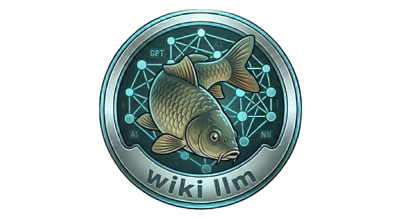
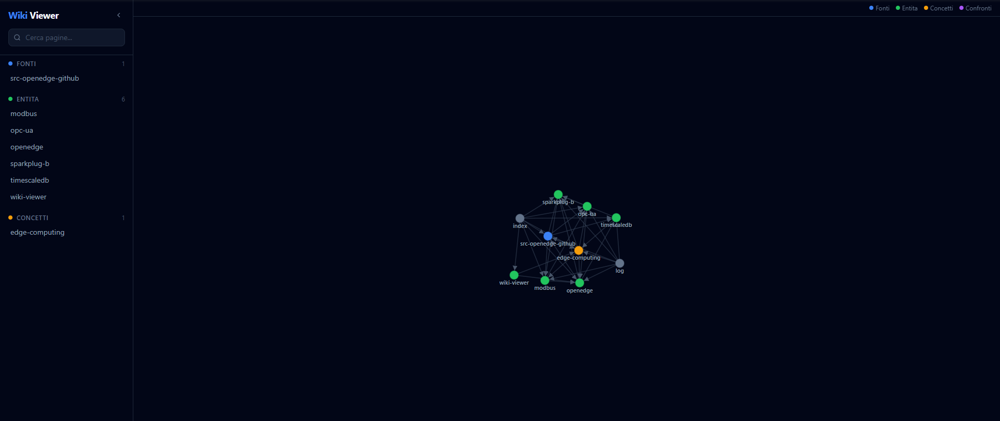

<p align="center">
  
</p>

<p align="center">
  <h1 align="center">LLM Wiki</h1>
  <p align="center">
    <strong>Personal knowledge base powered by Claude Code + Obsidian.</strong><br>
    Obsidian vault with `[[wikilinks]]`, semantic search via RTFM MCP, and an interactive web graph viewer.
  </p>
  <p align="center">
    
    
    
    
    
    
  </p>
</p>

<p align="center">
  
</p>

---

## One-Shot Setup

Clone, run one script, everything is installed automatically:

```bash
# Clone
git clone https://github.com/inferis995/llm-wiki.git my-wiki
cd my-wiki

# Install everything (Obsidian, RTFM MCP, skills, web UI, git)
./install.sh          # Linux/macOS
# or
.\install.ps1         # Windows
```

**The install script handles:**
- Downloads and installs [Obsidian](https://obsidian.md) (latest release from GitHub)
- Installs [RTFM MCP](https://github.com/roomi-fields/rtfm) via `pip install rtfm-ai`
- Configures `~/.mcp.json` with RTFM server settings
- Installs the Obsidian Vault skill (`~/.claude/skills/obsidian-vault/`)
- Installs the LLM Wiki skill (`~/.claude/skills/llm-wiki/`)
- Installs web UI dependencies (`npm install`)
- Initializes git and syncs RTFM index

**After install, just:**
1. Open the folder as an Obsidian vault
2. Restart Claude Code (to load MCP servers)
3. Say `ingest <url>` to add your first source

That's it. No manual configuration needed.

## What You Get

| Feature | Description |
|---------|-------------|
| **Obsidian Vault** | This repo IS an Obsidian vault — open it directly, edit with `[[wikilinks]]`, use graph view |
| **Wiki Engine** | Structured markdown with `[[wikilinks]]`, auto-indexing, categories (sources, entities, concepts, comparisons) |
| **Claude Code Skill** | Ingest sources, query knowledge, auto-save, health-check your wiki |
| **RTFM MCP** | Semantic search over all wiki content — find anything instantly |
| **Web UI** | Next.js + D3.js force-directed graph + markdown viewer with clickable wikilinks |
| **Browser Clippings** | Save web clippings via Obsidian clipper — they appear automatically in the web UI |

## Requirements

| Tool | Auto-installed? | Notes |
|------|----------------|-------|
| **Obsidian** | Yes | Downloaded from GitHub releases |
| **RTFM MCP** | Yes | Installed via `pip install rtfm-ai` |
| **Claude Code** | No | Required — [install guide](https://docs.anthropic.com/en/docs/claude-code) |
| **Node.js 18+** | No | Required for web UI — [download](https://nodejs.org) |
| **Python 3** | No | Required for RTFM MCP — [download](https://python.org) |
| **Git** | No | Required for version control |

## Usage

### Ingest a source
```
> ingest https://github.com/some/project
```
Claude reads the source, creates wiki pages with `[[wikilinks]]`, updates the index, syncs RTFM, and commits.

### Query the wiki
```
> What do I know about Docker networking?
```
Claude uses RTFM semantic search to find relevant pages and answers with `[[wikilink]]` citations.

### Health check
```
> wiki lint
```
Claude scans for orphans, contradictions, and missing cross-references.

### Auto-save
Knowledge is saved automatically during conversations when useful information emerges. No manual action needed. Every save triggers RTFM sync so new content is instantly searchable.

### Browser Clippings
Use the [Obsidian Web Clipper](https://obsidian.md/clipper) browser extension to save web pages. Clippings appear in the `Clippings/` folder and show up as red nodes in the web UI.

## Web UI

Interactive force-directed graph visualization of your wiki.

```bash
cd web
npm run dev
# Open http://localhost:3000
```

**Features:**
- D3.js force-directed graph with zoom and drag
- Color-coded nodes by category (blue=sources, green=entities, yellow=concepts, purple=comparisons, red=clippings)
- Click nodes to read pages
- Clickable `[[wikilinks]]` in content
- Sidebar navigation with search
- Backlinks and related pages

### Custom wiki path
Create `web/.env.local`:
```
WIKI_PATH=/path/to/your/wiki/content
```

## Obsidian Vault

This repo is a fully functional Obsidian vault:

1. **Open** this repo folder as a vault ("Open folder as vault")
2. **Edit** pages in Obsidian — Claude reads and updates them too
3. **Graph view** (icon in left sidebar) shows connections between all wiki pages
4. **Search** with Ctrl/Cmd+Shift+F across all content
5. **Web Clipper** saves clippings from your browser directly to the vault

### Obsidian Skill

The [Obsidian Vault skill](https://skills.sh/mattpocock/skills/obsidian-vault) is installed automatically by the setup script. It adds conventions:
- Flat structure at vault root when possible
- Title Case filenames
- Index notes for navigation
- Backlink discovery via grep

## Project Structure

```
llm-wiki/
├── CLAUDE.md          # Wiki schema (operations, page format, conventions)
├── README.md          # This file
├── LICENSE            # MIT
├── .gitignore
├── install.sh         # One-shot setup (Linux/macOS)
├── install.ps1        # One-shot setup (Windows)
│
├── skill/
│   └── SKILL.md       # Claude Code skill (installed to ~/.claude/skills/llm-wiki/)
│
├── web/               # Next.js graph viewer
│   ├── src/
│   │   ├── app/       # Server components (reads wiki at build time)
│   │   ├── components/ # ForceGraph, MarkdownViewer, HomeClient
│   │   └── lib/       # wiki.ts (file reader), types.ts
│   ├── package.json
│   ├── next.config.mjs
│   ├── tailwind.config.ts
│   └── tsconfig.json
│
├── wiki/              # Your knowledge (markdown files)
│   ├── index.md       # Page catalog
│   ├── log.md         # Chronological record
│   ├── sources/       # Source summaries
│   ├── entities/      # Things (software, hardware, protocols...)
│   ├── concepts/      # Ideas (patterns, architectures, concepts...)
│   └── comparisons/   # Head-to-head comparisons
│
├── Clippings/         # Browser clippings (saved via Obsidian web clipper)
│
├── raw/               # Original source documents (immutable)
│
└── docs/
    └── auto-rules.md  # Template for Claude Code auto-save rules
```

## Wiki Categories

| Category | Folder | Color | Description |
|----------|--------|-------|-------------|
| **Sources** | `wiki/sources/` | Blue | Summaries of ingested content (prefix `src-`) |
| **Entities** | `wiki/entities/` | Green | Things: software, hardware, protocols, tools |
| **Concepts** | `wiki/concepts/` | Yellow | Ideas: patterns, architectures, abstractions |
| **Comparisons** | `wiki/comparisons/` | Purple | Head-to-head feature comparisons |
| **Clippings** | `Clippings/` | Red | Browser clippings saved via Obsidian |

## How It Works

```
┌──────────────┐     ingest      ┌──────────────┐
│   Source      │ ──────────────► │  raw/         │  (immutable originals)
│  (URL/file)   │                  └──────────────┘
└──────────────┘                         │
                                          ▼
┌──────────────┐     create      ┌──────────────┐
│  Claude Code │ ──────────────► │  wiki/        │  (structured markdown)
│  (skill)     │ ◄────────────── │  sources/     │
└──────┬───────┘     query       │  entities/    │
       │                        │  concepts/    │
       ▼                        │  comparisons/ │
┌──────────────┐                  └──────┬───────┘
│  RTFM MCP    │ ◄──── sync ────────────┘
│  (search)    │ ─── semantic search ────┘
└──────┬───────┘
       │
       ▼
┌──────────────┐     read        ┌──────────────┐
│  Web UI      │ ◄────────────── │  wiki/        │
│  (Next.js)   │                  │  Clippings/   │
└──────────────┘                  └──────────────┘
       ▲
       │
┌──────────────┐
│  Obsidian    │ ─── edit/clip ──► wiki/ + Clippings/
│  (vault)     │ ◄── graph view ──┘
└──────────────┘
```

## License

MIT &copy; 2026 [inferis995](https://github.com/inferis995)